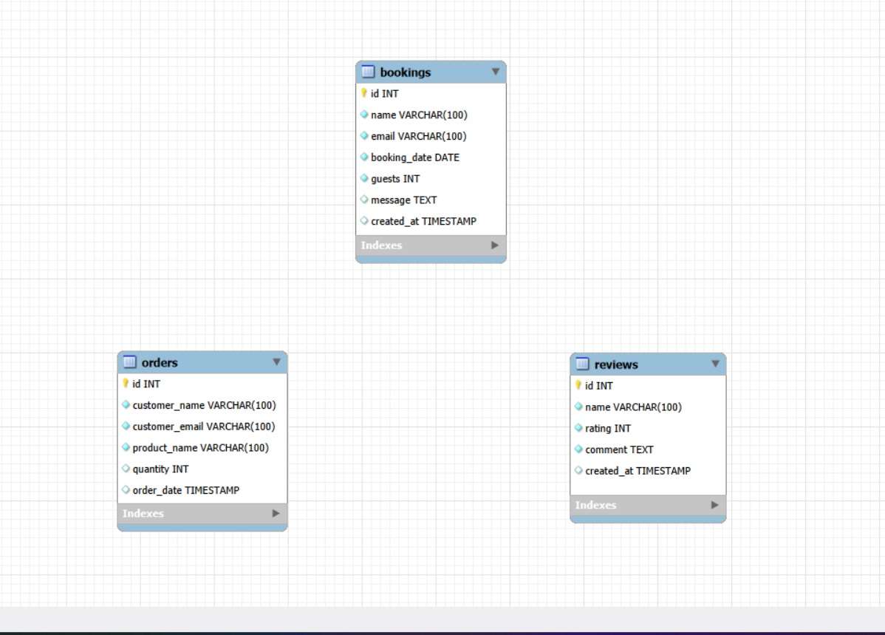

# tastebudkoto
Finnish-Sri Lankan lakeside villa website
(Team No -08)

README.md 
# Project Overview
TasteBudKoto is a fictional villa and culinary experience website located in Hämeenlinna, Finland. The project was created by three Sri Lankan students studying Computer Applications at HAMK University of Applied Sciences as part of our academic coursework.

The website presents a peaceful Finnish lakeside retreat that combines the beauty of Nordic nature with authentic Sri Lankan hospitality. TasteBudKoto is designed as an informational and promotional platform aimed at potential visitors who are interested in unique cultural and culinary experiences.

Table of Contents
Features
Database Tables
Created Forms
Created Tables

# Features

 **Feature 1 (Chinthani Hewavitharana)**: Villa Booking System & Gallery Filter.

 **Feature 2 (Elakawage Don Dilini)**: Product Order System.

 **Feature 3 (Samaraweera Kushani)**: Guest Reviews System.

A complete booking system that allows guests to reserve the villa. Users fill out a booking form with their details, check-in date, and number of guests. All bookings are stored in the bookings database table and can be managed by admin with full CRUD operations.

Additionally, implemented an interactive gallery filter using JavaScript that allows users to filter images by category (Villa, Nature, Food) with simple button click events.

**Code Files:**

**contact.php** - Booking form with JavaScript validation

**admin.php** - Admin panel to view/delete bookings

**gallery.php** - Gallery with JavaScript filter

**db.php** - Database connection

**Links:**

**Booking Form:**   http://shell.hamk.fi/~bbcap25_14/tastebudkoto/contact.php

**Gallery Filter:** http://shell.hamk.fi/~bbcap25_14/tastebudkoto/gallery.php

**Admin Panel:**    http://shell.hamk.fi/~bbcap25_14/tastebudkoto/admin.php

**CRUD Operations:**

**Create:** Booking form submits to bookings table

**Read:** Admin panel displays all bookings

**Delete:** Admin can delete bookings

**JavaScript:** Form validation and gallery filter with onclick events

**Feature 2** (Elakawage Don Dilini): Product Order System

A product catalog displaying Taste Bud Foods products with "Order Now" buttons. Users can place orders for products like Kithul Treacle, Curry Mixes, and Flour Blends. Orders are saved to the orders database table and can be managed by admin.

**Code Files:**

**experiences.php** - Displays products with order buttons

**order-product.php** - Order form with JavaScript validation

**admin-orders.php** - Admin panel to view/delete orders

**Links:**

**Products Page:**  http://shell.hamk.fi/~bbcap25_14/tastebudkoto/experiences.php

**Order Form:**     http://shell.hamk.fi/~bbcap25_14/tastebudkoto/order-product.php

**Admin Orders:**   http://shell.hamk.fi/~bbcap25_14/tastebudkoto/admin-orders.php

**CRUD Operations:**

**Create:** Order form submits to orders table

**Read:** Admin panel displays all orders

**Delete:** Admin can delete orders

**JavaScript:** Form validation with onsubmit event

**Feature 3** (Samaraweera Kushani): Guest Reviews System

A review system where guests can share their experiences. Users submit reviews with name, rating, and comments. Reviews are displayed on the About page and can be moderated by admin.

**Code Files:**
**about.php** - Displays reviews and submission form

**admin-reviews.php** - Admin panel to delete reviews

**Links:**

**Reviews Page:** http://shell.hamk.fi/~bbcap25_14/tastebudkoto/about.php

**Admin Reviews:** http://shell.hamk.fi/~bbcap25_14/tastebudkoto/admin-reviews.php

**CRUD Operations:**

**Create:** Review form submits to reviews table

**Read:** About page displays all approved reviews

**Delete:** Admin can delete inappropriate reviews

**JavaScript:** Form validation with minimum 10 characters

# Database Tables

**Table 1 (Chinthani Hewavitharana):** bookings (Stores villa booking requests from contact form)

**Table 2 (Elakawage Don Dilini):** Orders  (Stores product orders placed by customers)

**Table 3 (CSamaraweera Kushani):** reviews (Stores guest reviews and ratings)

## Database ER Diagram

Tables are independent with no foreign key relationships, each serving a separate feature.

## Created Forms

| Form | Created By | Form Name | Code Link | Live Link | Validations Applied |
|------|------------|-----------|-----------|-----------|---------------------|
| **Form 1** | Chinthani | Villa Booking Form | [`contact.php`](https://github.com/chinthani-bit/tastebudkoto/blob/main/contact.php) | [link](http://shell.hamk.fi/~bbcap25_14/tastebudkoto/contact.php) | • Name not empty • Valid email format • Date selected • Guests between 1-6 |
| **Form 2** | Dilini | Product Order Form | [`order-product.php`](https://github.com/chinthani-bit/tastebudkoto/blob/main/order-product.php) | [link](http://shell.hamk.fi/~bbcap25_14/tastebudkoto/order-product.php) | • Name not empty • Valid email format • Quantity ≥ 1 |
| **Form 3** | Sandeepani | Guest Review Form | [`about.php`](https://github.com/chinthani-bit/tastebudkoto/blob/main/about.php) | [link](http://shell.hamk.fi/~bbcap25_14/tastebudkoto/about.php) | • Name not empty • Rating selected • Comment not empty • Min 10 characters |

## Created Tables

| Table | Created By | Table Name | Code Link | Live Table Link |
|-------|------------|------------|-----------|-----------------|
| **Table 1** | Chinthani | `bookings` | [`admin.php`](https://github.com/chinthani-bit/tastebudkoto/blob/main/admin.php) | [View Data](http://shell.hamk.fi/~bbcap25_14/tastebudkoto/admin.php) |
| **Table 2** | Dilini | `orders` | [`admin-orders.php`](https://github.com/chinthani-bit/tastebudkoto/blob/main/admin-orders.php) | [View Data](http://shell.hamk.fi/~bbcap25_14/tastebudkoto/admin-orders.php) |
| **Table 3** | Sandeepani | `reviews` | [`admin-reviews.php`](https://github.com/chinthani-bit/tastebudkoto/blob/main/admin-reviews.php) | [View Data](http://shell.hamk.fi/~bbcap25_14/tastebudkoto/admin-reviews.php) |